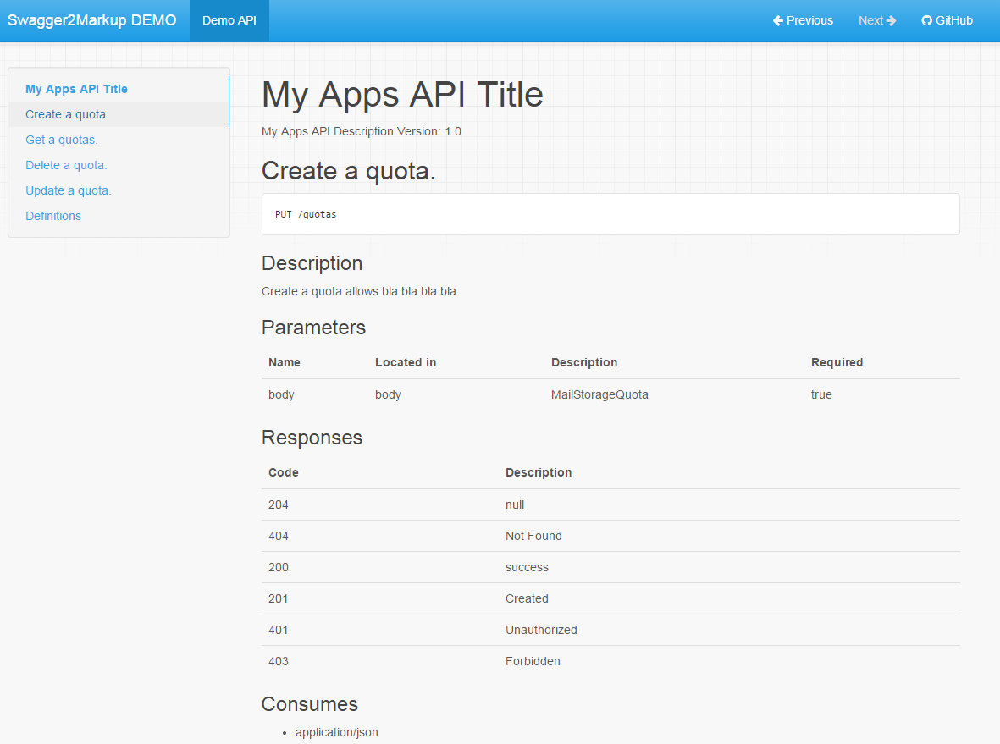

= Swagger2Markup Demo
:author: Robert Winkler
:version: 0.1.0
:hardbreaks:
== Overview

This project is a Swagger to Markup (AsciiDoc and Markdown) converter demo using https://github.com/spring-projects/spring-boot[Spring Boot] and https://github.com/martypitt/swagger-springmvc[swagger-springmvc].
The Markdown documentation is using https://github.com/tomchristie/mkdocs[MkDocs] and https://github.com/rtfd/readthedocs.org[ReadTheDocs].
See http://spring-swagger2markup-demo.readthedocs.org/[ReadTheDocs-demo].

== Demo

[source,java]
----
@RunWith(SpringJUnit4ClassRunner.class)
@SpringApplicationConfiguration(classes = SpringBootSwaggerConfig.class)
@IntegrationTest
@WebAppConfiguration
public class Swagger2MarkupTest {

    @Test
    public void convertSwaggerToMarkup() {
        //Remote
        Swagger2MarkupConverter.from("http://localhost:8080/api-docs").
                withMarkupLanguage(MarkupLanguage.MARKDOWN).
                withExamples("docs/generated").withSchemas("docs/schemas").build()
                .intoFolder("src/docs/markdown");

        Swagger2MarkupConverter.from("http://localhost:8080/api-docs").
                withExamples("docs").withSchemas("docs/schemas").build()
                .intoFolder("src/docs/asciidoc");

        //Local
        File file = new File(Swagger2MarkupTest.class.getResource("/json/swagger.json").getFile());
        Swagger2MarkupConverter.from(file.getAbsolutePath()).build()
                        .intoFolder("src/docs/asciidoc");
    }

}
----

[source,java]
----
@SpringBootApplication
@EnableSwagger
public class SpringBootSwaggerConfig {

    public static void main(String[] args) {
        SpringApplication.run(SpringBootTestConfig.class, args);
    }

    @Autowired
    private SpringSwaggerConfig springSwaggerConfig;

    @Bean
    public SwaggerSpringMvcPlugin customImplementation(){
        return new SwaggerSpringMvcPlugin(this.springSwaggerConfig)
                .apiInfo(apiInfo()).excludeAnnotations(Controller.class);
    }

    private ApiInfo apiInfo() {
        ApiInfo apiInfo = new ApiInfo(
                "My Apps API Title",
                "My Apps API Description",
                "My Apps API terms of service",
                "My Apps API Contact Email",
                "My Apps API Licence Type",
                "My Apps API License URL"
        );
        return apiInfo;
    }
}
----

=== Generated HTML via Mkdocs
